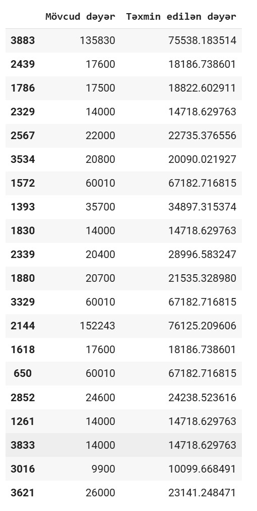
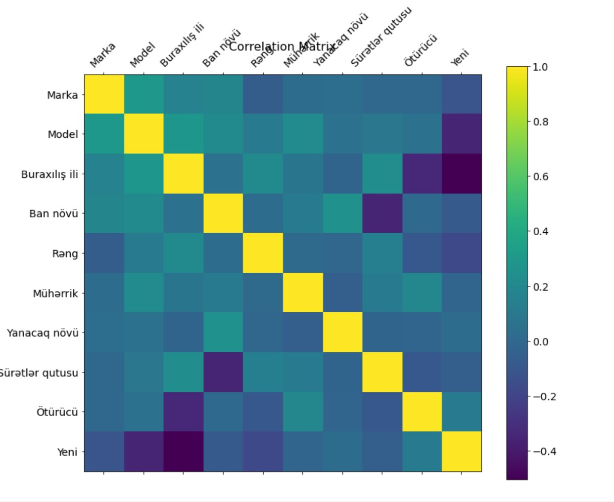
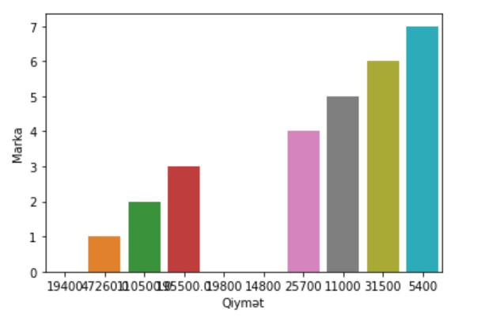
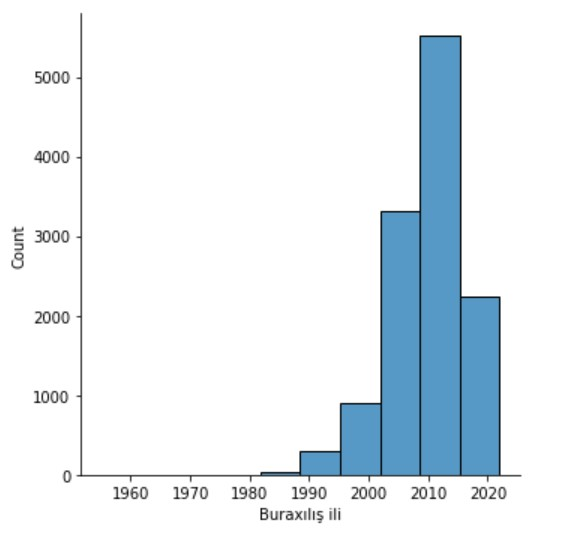

# Turbo.az-machine-learning
 ## Exploratory Data Analysis
 ## Encoding
 ##  Visualization
 ## Remove Outlayers
 ## MinMaxScaler, StandartScaler
 ## DATA TRAIN TEST SPLIT
 ## Linear Regression
 ## RandomForest Regression

 

 ## Predictions

##
##
##
## Correlation Matrix

##
##
##

##
##
##

